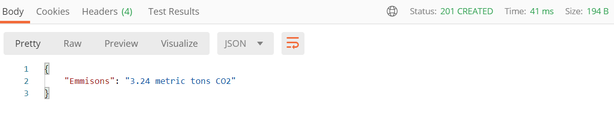

# Flask Carbon API
An API developed to work out the about of emmissions produced when a shipment is fulliled.




The API  will calculate emissions produced when shipping products around the world. I got this idea from a website called [patch](https://www.usepatch.com/).
The company offsets carbon by working out the emissions generated when shipping a product.

Please read the [blog post of this project on my website for more info](https://www.tobiolabode.com/blog/2020/6/25/python-api-for-carbon-emmissions).

## Requirements
- Flask
- Flask-RESTful
- Requests


## Usage
You can test the API by using a local host. To do that clone the Project:
```
clone https://github.com/tobiolabode/Flask_Carbon_API.git
```
Then run flask_restful_ex.py
```
python flask_restful_ex.py
```
This will run the server

You can then use the request.py file to send info at the API

format your request into a JSON or a JSON format:
```json
{  "km": 5000,  "tonnes": 100000}

```

To caluate road freight use add '/road_freight' and the end of your local host address

To caluate boat freight use add '/boat_freight' and the end of your local host address

The road_freight only allows for miles and tonnes
The boat_freight allows for both miles and kilometeres
